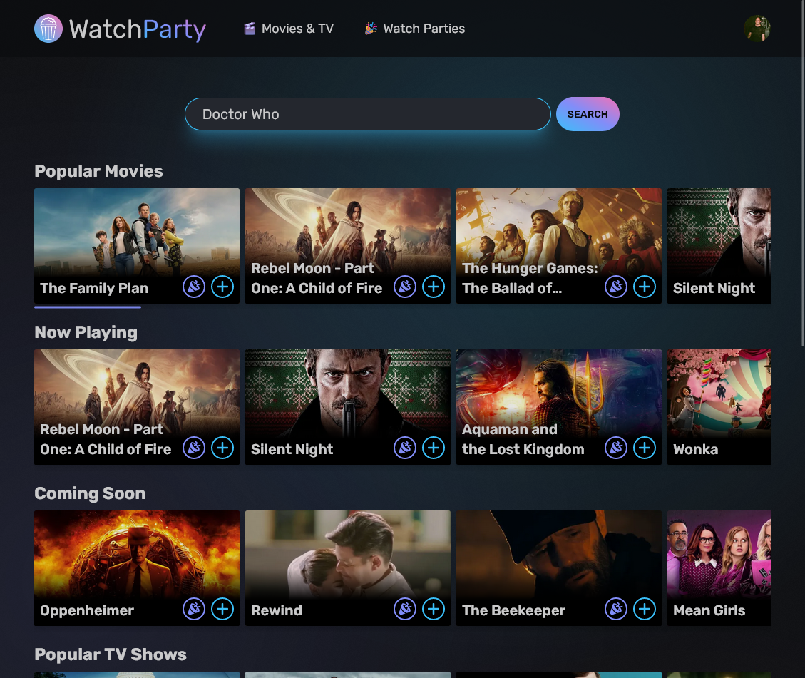
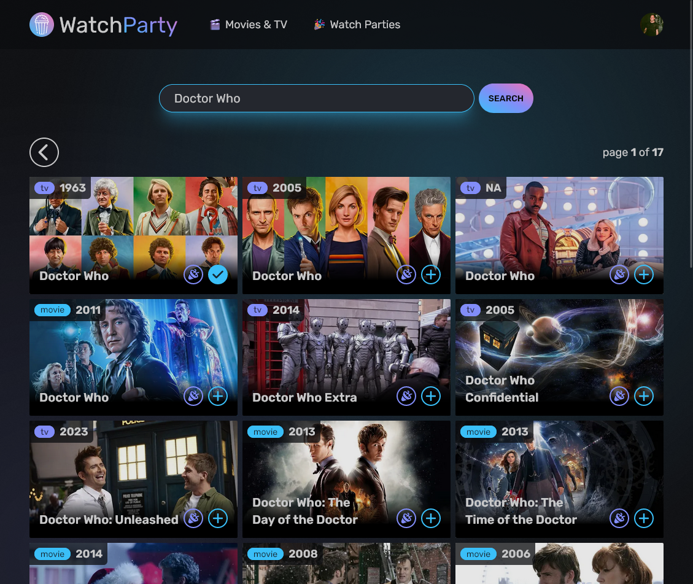
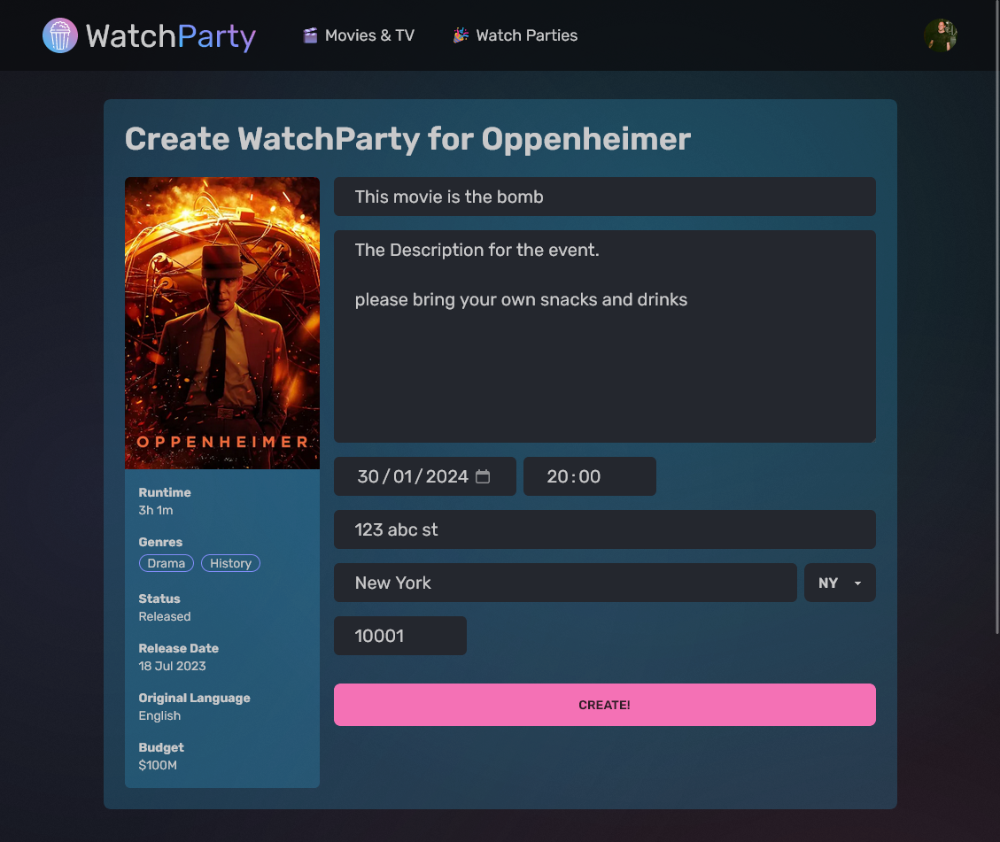
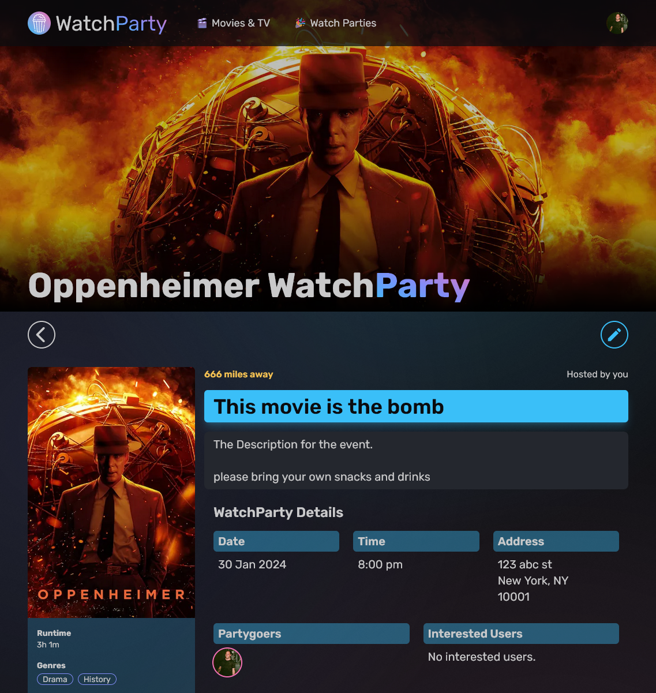
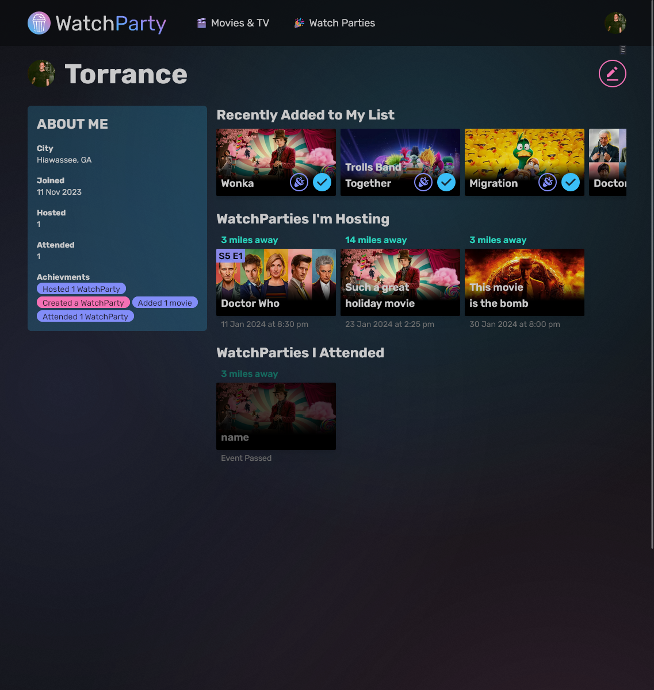
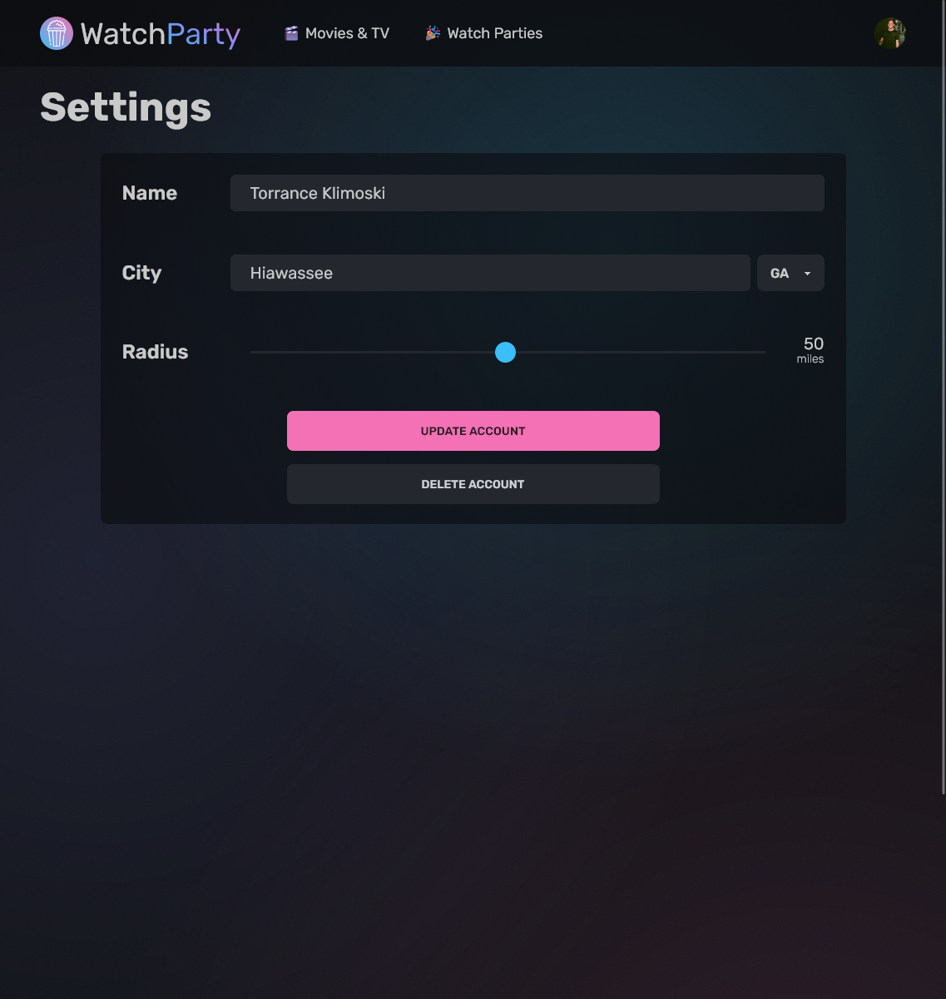

# WatchParty

Developed by TJ Klimoski.

[Live demo](https://watchparty-six.vercel.app/)  
[Github](https://github.com/Tjklimoski/watchparty)

## About WatchParty

Discover Movies and TV Shows you can host group events for in your area.

The user can search through a database of current and upcoming movies and tv shows, or serach for a specific title. The user can add the movie or show to their list and/or create a WatchParty event for their selected media. The User can search for nearby WatchParties based off the user's current location and desired radius, and attend or follow any WatchParty.

## Technologies

Spotify player was built with:

- React (Next Framework)
- Mongodb
- Prisma ORM
- RESTful API
- Axios
- SWR
- NextAuth / Auth.js
- The Movie Database API
- OpenWeatherMap geocoding API
- Geolocation browser API
- Typescript
- HTML
- CSS / Tailwind / DaisyUI

## How to Run Locally

Clone repo:

    git clone https://github.com/Tjklimoski/watchparty.git

Install dependecies:

    npm i

Add a `.env` file and `.env.development.local` file

    touch .env; touch .env.development.local

Populate the `.env` file with your Mongodb connection url:

    # MONGODB
    DATABASE_URL=your_db_url

Populate the `.env.development.local` file with:

    # Node
    NODE_ENV=development
    NEXT_PUBLIC_ORIGIN=http://localhost:3000

    # The Movie Database
    TMDB_ACCESS_TOKEN=your_access_token

    # OpenWeatherMap API - for geocoding
    OWM_API_KEY=your_key

    # NEXTAUTH
    NEXTAUTH_URL=http://localhost:3000
    NEXTAUTH_SECRET=your_secret

    # GOOGLE OAUTH
    GOOGLE_CLIENT_ID=your_google_client_id
    GOOGLE_CLIENT_SECRET=your_google_client_secret

    # GITHUB OAUTH
    GH_CLIENT_ID=your_github_client_id
    GH_CLIENT_SECRET=your_github_client_secret

Then, to run locally:

    npm run dev
